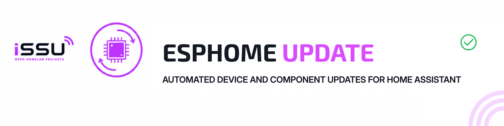

<div align="center">

[](#project-status)
[](https://www.home-assistant.io/)
[](https://esphome.io/)
[](LICENSE)

**Automatically install available ESPHome device and add-on updates.**

ESPHome Update is a small Home Assistant package that checks all ESPHome update entities once per day and installs available updates sequentially.

</div>

---

## Project Status

| Field | Current state |
|---|---|
| **Maturity** | 🟡 Active Development |
| **Used in my homelab** | ✅ Yes |
| **Recommended for production** | ❌ Not yet |
| **Setup difficulty** | 🟡 Intermediate |
| **Documentation** | ✅ Complete for the current scope |

> [!WARNING]
> This package installs firmware and add-on updates automatically. ESPHome devices may restart and become temporarily unavailable. Test the package with your own entities before enabling the daily automation.

---

## Why It Exists

ESPHome Update was created to avoid opening every device update individually across multiple Home Assistant instances.

The package discovers available ESPHome device updates automatically, optionally includes the ESPHome add-on, installs them one at a time and can send a final result notification.

---

## Features

- 🔎 Finds available update entities provided by the ESPHome integration.
- 🧩 Optionally includes the ESPHome add-on update.
- 🔁 Installs updates sequentially to avoid starting every update at once.
- ⏱️ Uses a configurable timeout for each entity.
- ✅ Records successful updates and failures.
- 📱 Supports an optional notification action.
- 🔕 Can remain completely silent when no update is available.
- 🕐 Runs daily at `01:00` by default.
- ▶️ Can also be started manually from Home Assistant.

---

## Installation

This file uses the Home Assistant [packages](https://www.home-assistant.io/docs/configuration/packages/) format.

1. Ensure packages are enabled in `configuration.yaml`:

```yaml
homeassistant:
  packages: !include_dir_named packages
```

2. Copy [`esphome_update.yaml`](esphome_update.yaml) to:

```text
/config/packages/esphome_update.yaml
```

3. Validate the Home Assistant configuration.
4. Restart Home Assistant.

The package creates:

- `automation.esphome_update_daily`
- `script.esphome_update_all`

---

## Configuration

Edit the **Configuration** variables near the beginning of `esphome_update.yaml`.

### Notifications

Notifications are disabled by default:

```yaml
notification_action: ""
```

To enable them, enter an existing Home Assistant notification action:

```yaml
notification_action: "notify.mobile_app_your_phone"
```

Choose whether to receive a message when no update is available:

```yaml
notify_when_no_updates: false
```

### ESPHome add-on

The default add-on update entity is:

```yaml
esphome_addon_entity_id: "update.esphome_update"
```

Change it if your entity uses another ID, or set it to an empty string to update devices only:

```yaml
esphome_addon_entity_id: ""
```

### Timing

The automation runs every day at `01:00`. Change the time trigger if required:

```yaml
at: "01:00:00"
```

Each update has a five-minute timeout, followed by a five-second pause before the next entity.

---

## How It Works

```text
Daily trigger or manual script run
                │
                ▼
Find ESPHome device updates
                │
                ▼
Optionally add the ESPHome add-on
                │
                ▼
Install each update sequentially
                │
                ▼
Wait for completion and record result
                │
                ▼
Optionally send a summary notification
```

---

## Notes and Limitations

- Only entities currently in the `on` state are selected.
- An update is considered successful when its entity returns to `off` before the timeout.
- A timeout is reported as a failure even if the device completes the update later.
- The automation uses `mode: single`; a second run cannot start while one is already active.
- Automatic updates can introduce upstream changes. Review ESPHome release notes when reliability is critical.

---

## License

Released under the [MIT License](LICENSE).

---

<div align="center">

This project is part of the **iSSU Open Homelab ecosystem**.

<a href="https://github.com/issu-lab/Open-Homelab">
  
</a>

</div>
